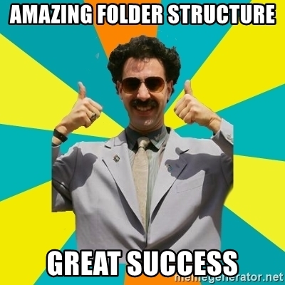

# Day04: [🔗link](https://devs-nest.github.io/frontend-assignments/Day04/)

### Topic : HTML : Graphics, Media

### Tips :

- Use video, audio, svg tags
- You can use your own creativity

### Assignments :

- Add a Video to the site [🔗link](https://www.youtube.com/watch?v=hN6hyvtL-Wc)
- Add a Audio to the site [🔗link](https://www.youtube.com/watch?v=XvhDw5bQbd8)
- Add a SVG circle.
- More different data more complex to mannage. so First make a good folder structure.
  According bellow.
```
  -- assests
      |-- audio           // all audio goes here
      |-- images          // all images goes here
          |-- logos       // all logo image goes here
      |-- videos          // all videos goes here
  -- pages                // all subpages goes here
```

## Meme Section :


