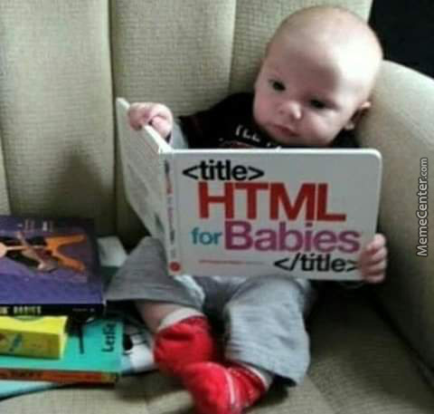

# Day05: [🔗link](https://devs-nest.github.io/frontend-assignments/Day05/)

### Topic : HTML / CSS : emojis, symbols, charset, Introductions to css

### Tips :

- Try to give id & class name relevant to the section and unique.
- Also observe the common style in different section and apply style all together.
- Best Practice

```css
* {
	margin: 0;
	padding: 0;
  box-sizing: border-box;
}
// its prevent default margin and padding.
after apply this. just see the magic 🪄🎩
```

- use your creativity

### Assignments :

- Add atleast 2 emojis any where in the page
- CSS
- Navbar Section \***Only use Inline css**
  - add border, margin, padding
- Restaurant Locator Section \***Only use internal css**
  - style table
- Footer Section \***Only use internal css**
- All FoodItem Section, Order & Delivered Section, Offers & News Section \***Only use external css**
  - Observe and add CSS

```
  -- assests
      |-- audio           // all audio goes here
      |-- images          // all images goes here
          |-- logos       // all logo image goes here
      |-- videos          // all videos goes here
  -- pages                // all subpages goes here
  -- styles               // all css goes here
```

## Meme Section :

I think you are now planning to give this👇 to your Child.


