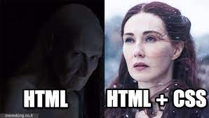

# Day06: [🔗link](https://devs-nest.github.io/frontend-assignments/Day06/)

### Topic : CSS : Commnets, colors, box model, fonts, position, z-index

### Tips :

- Use Your Creativity
- css propertity used here
  - text-decoration
  - list-style-type
  - color
  - background-color
  - border-radius
  - display (block, inline-block)
  - position (relative/absolute)
  - top/bottom/left/right
  - z-index
  - font-size
  - font-weight
  - line-spacing
  - text-align
  - text-transformation
  - cursor
  - max-width
  - outline
- Color Code:
  - | Name        | Code    |
    | ----------- | ------- |
    | Red         | #ffbc0d |
    | Yellow      | #ffbc0d |
    | Orange-Gray | #ffbc0d |

### Assignments :

- Add any font as your wise. I use [Roboto](https://fonts.google.com/specimen/Roboto)
- NavBar
  - Remove default ul & a style
  - add font color, background color, border radius
  - remove all margin
  - add bottom margin
- Food Items
  - positon the food item image
  - add color to the subheading, and contains.
  - style the ingredients
    - fist cover with div
    - style the component
- Order & Delivered Section
  - style the subheading
  - style _OrderNow_ button
- Offers & News Section
  - position the image bottom right
  - style the input field
  - style the button
  - divide in subcomponents

```
        |-- offers_news_section
            |-- offers_news_section_bg
                |-- Subscribe-bg image
            |-- offers_news_section_main
                |-- offer_news
                |-- offers_news_section_contents
                    |-- h1
                    |-- p
                    |-- form
                    |-- follwo_text
                    |-- social_icons
```
- footer section
    - footer_extra_links style
        - remove default a style
        - style font
    - add copyright_link img with hyperlink

#

## Meme Section :


````
