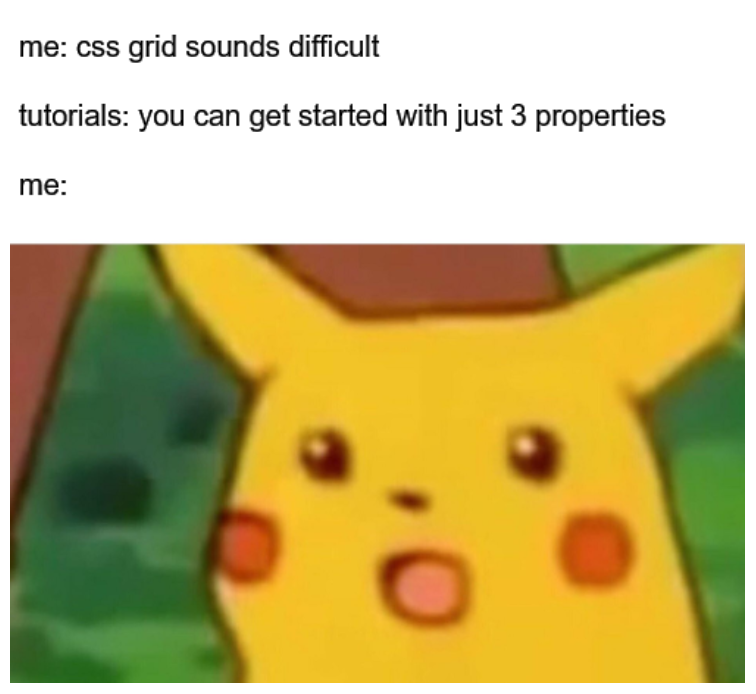

# Day07: [🔗link](https://devs-nest.github.io/frontend-assignments/Day07/)

### Topic : CSS : Flex box, grid, layout, !important, priorities

### Tips :

- Use Your Creativity
- new css propertity used here

  - display (flex/grid)
  - flex-properties
    - justify-content
    - align-items
    - flex-direction
  - box-shadow
  - grid-properties
    - grid-template-columns
    - grid-area
    - justify-self
  - user-select

- try this Game

  - [flexboxfroggy](https://flexboxfroggy.com/) : flex box game
  - [cssgridgarden](https://cssgridgarden.com/) : grid game

- [cssgrid-generator](https://cssgrid-generator.netlify.app/)

- Color Code:
  - | Name        | Code    |
    | ----------- | ------- |
    | Red         | #ffbc0d |
    | Yellow      | #ffbc0d |
    | Orange-Gray | #ffbc0d |

### Assignments :

- NavBar

  - link the header logo to home page
  - style the navbar using flexbox
  - add boxshadow

- Food Items

  - divede into small components
  - position food & item_contents & nutrition_contents **Grid Only**
  - style this sections
    - nutrition_contents using flex

- Order & Delivered Section * **Most Interesting section 🧐** *

  - divede into small components
    - section
      - image
      - contents
        - add mcdelivery logo and gif before h1
  - style this sections
  - increase h1 font size
  - section background color to yellow(#ffbc0d)
  - boxshadow to button
  - make baseline same all elements in now_also_section using flex

- Offers & News Section

  - center the all contents
  - style the sections
  - add box shadow into button
  - baseline same all elements in follow_us_section using flex

- footer section
  - center all contents

#

## Meme Section :

