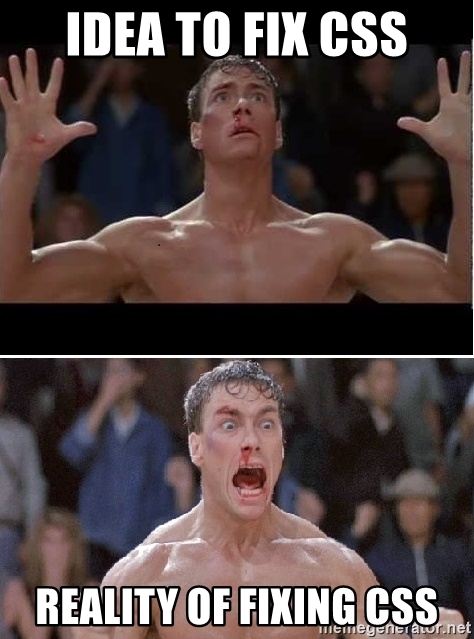

# Day08: [🔗link](https://devs-nest.github.io/frontend-assignments/Day08/)

### Topic : CSS: gradient, transforms, animations

### Tips :

- Use Your Creativity
- new css propertity used here

  - ::-webkit-scrollbar
  - ::-webkit-scrollbar-track
  - ::-webkit-scrollbar-thumb
  - backdrop-filter (blur)
  - -webkit-text-stroke
  - -webkit-text-stroke-width
  - background (linear-gradient)
  - fill
  - animation
    - animation-name
    - animation-duration
    - animation-timing-function
    - animation-iteration-count
  - keyframes
  - transform
    - translateY
    - translateX
    - rotate

- Color Code:
  - | Name        | Code    |
    | ----------- | ------- |
    | Red         | #ffbc0d |
    | Yellow      | #ffbc0d |
    | Orange-Gray | #ffbc0d |

### Assignments :

- Add Favicon to the site
- change the site title
- change mouse cursor
- style scrollbar
- Adjust Navbar according to new hero section

  - add background blur
  - position over the hero section

- Hero section

  - right side
    - add image and gradients overlay
  - add animation down arrow

- Offers & News Section
  - add infinite animation
    - follow on text
    - on social_icon

#

## Meme Section :

