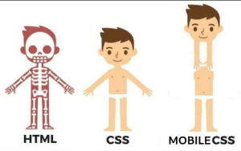

# Day10:[🔗link](https://devs-nest.github.io/frontend-assignments/Day10/)

### Topic : HTML/CSS : DOM, Events, Accessibility and SEO

### Tips :

- breakpoints - 0 to 768px and 768px to max
- add `<meta name="viewport" content="width=device-width, initial-scale=1.0" />` in head tag

### Assignments :

- make whole page responsive
- add alt text in all images
- change navbar in range of 0 to 600px

#

## Meme Section :

