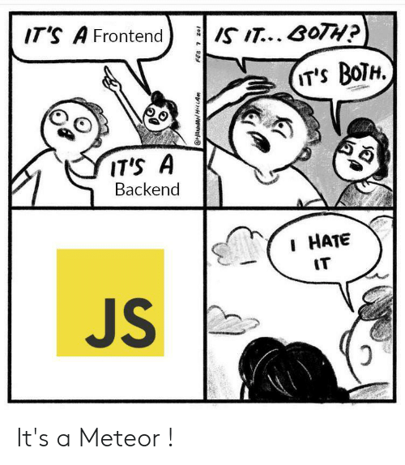

# Day11:[🔗link](https://devs-nest.github.io/frontend-assignments/Day11/)

### Topic : JS : Loops, Switch, Comparisons, Alerts, this

### Tips :

- use concept
  - for loop
  - forEach
  - array
    - push
    - pop
  - html element selector
  - createElement - for creating a html elements
  - add a data set in html element using js
  - small obj concept
  - textContent - update html text
  - setProperty - update css variables

### Assignments :

- create two global variables

```
BOARD_SIZE = 4
NUMBER_OF_MINUS = 2

TOTAL_TILES = BOARD_SIZE X BOARD_SIZE = 4 x 4 = 16
```

- create all tile dynamically
- update the css using js
- update the Mines left according to NUMBER_OF_MINUS

#

## Meme Section :


