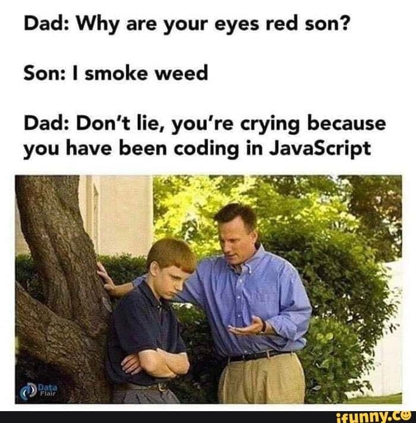

# Day12:[🔗link](https://devs-nest.github.io/frontend-assignments/Day12/)

### Topic : JS : Strings, Objects, Data types, Functions

### Tips :

- Game Logic

  - 1.  Populate a board with tiles/mines
  - 2.  right click on tiles
    - a . mark tiles
  - 3.  left click on tiles
    - a. reveal tiles
  - 4.  check for win/lose

- Use concept
  - function
  - import
  - Object
    - getter
    - setter
  - some
  - if/else
  - random
  - '===' and '&&' opearator
  - floor
  - addEventListener
  - mine

### Assignments :

- Create two js file
  - minesweeper.js - for game logic
  - script.js - for ui update
- wrap whole previous code in a function
  - createBoard()
- create a object of TILE_STATUSES
- add mines in the board randomly
- add new fields in tile object
  - mine : boolean - describe mine present or not at the current tile
  - status : 'hidden/mine/number/marked'
- add right & left eventlistener
- implement right click game logic
  - mark the tile
  - update the status to 'marked'
  - appy mark tile css

#

## Meme Section :

