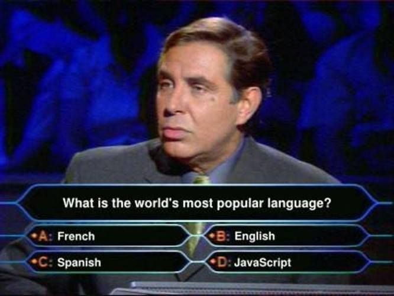

# Day13:[🔗link](https://devs-nest.github.io/frontend-assignments/Day13/)

### Topic : JS : Prototypes, inheritence, Classes, OOPS

### Tips :

- Game Logic

  - 1.  Populate a board with tiles/mines - [x]
  - 2.  right click on tiles - [x]
    - a . mark tiles - [x]
  - 3.  left click on tiles - do
    - a. reveal tiles
  - 4.  check for win/lose - do

- Use concept
  - filter
  - recursion - for finding nearest blank tiles
  - every
  - reduce

### Assignments :

- convert all code into classes

  - Minesweeper - game logic
  - MinesweeperUI - DOM manipulation

- implement revealTile logic on left click

  - number - show number
  - mine - game over
  - blank - find its adjacentTiles using recursion

- implement gameEnd logic
- update mineleft on right click

#

## Meme Section :

