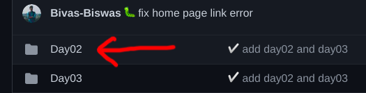
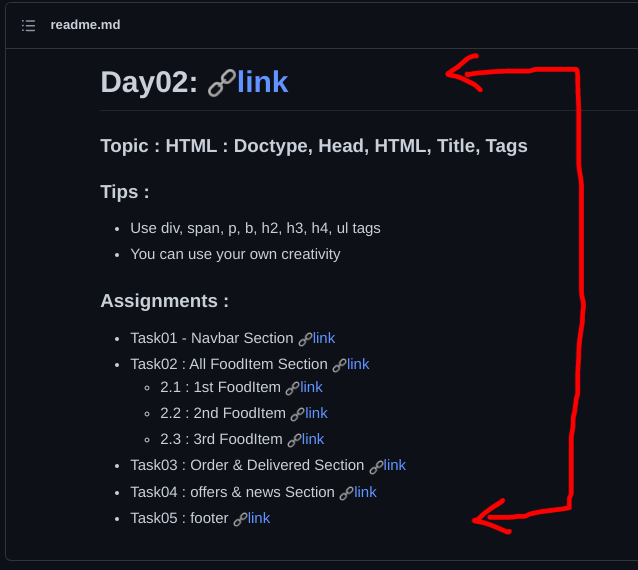
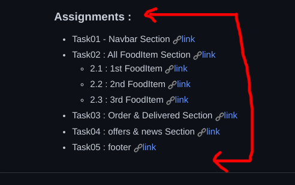
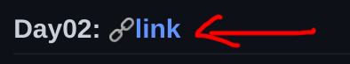
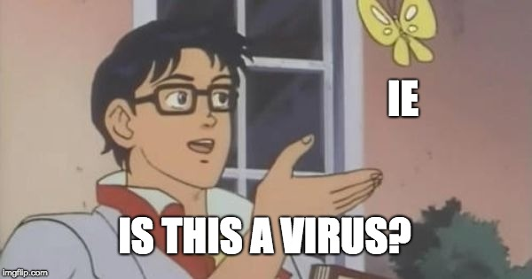

# Frontend Assignments

## How to see Assignments ?

- Go to daywise folder eg. for day two go to the Day02 folder.

- Scroll Down

- All given assignments under the Assignments tag.

- Click on the link to see the final outcome after finshing the all assignment.

#

If You Understand this meme, After the Frontend course.

Congratulations, you are a Frontend Developer.

<h2> All The Best 😊</h2>
